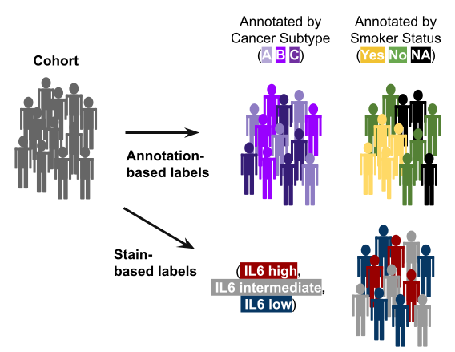
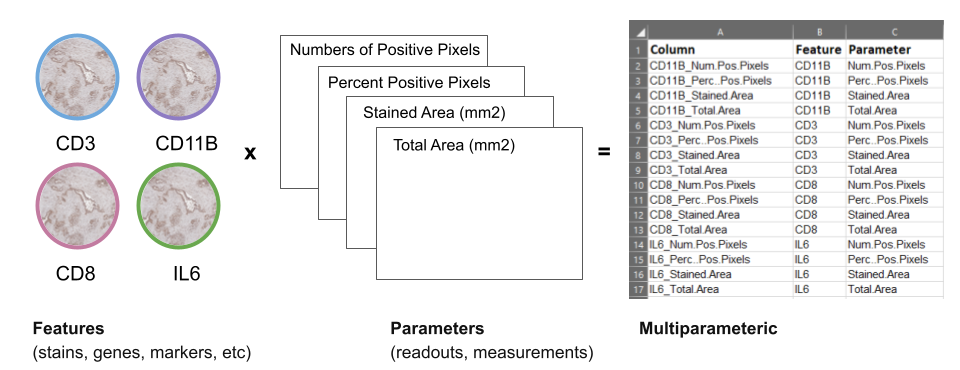

# What is Hourglass?

## tl;dr

**What?** 

   To facilitate exploration of multi-parametric data (especially bioimage quantification).
   
   
**For who?**

  Individuals who need their data plotted hands-free.
  
  
**How?** 

   Provide user preferences to filter and subset large datasets and compare groups in an automated manner.
   
## Roadmap
```{r, echo=FALSE, fig.align="center", out.width="100%"}
knitr::include_graphics("images/overall_inputoutput.png")
```
  
## Is this you?
		      
You are a researcher that has access to multiple tumors samples from different patients. You have deidentified information about each patient's medication history, sex, smoker status, disease-free survival time, and so much more. You also sectioned and stained the tissue samples with 40 cell type markers and took images of them using a microscope. You used a bioimage analysis software to quantify the area, number of stained pixels, etc. 

Now you have a huge table with both patient information and stain quantification! You really wanted to determine the relationship between drug history and a group of markers. You are overwhelmed because you do not know where to start and your local bioinformatician is swamped with work. No need to fear, now you have Hourglass and you can easily uncover hidden secrets by just asking questions!

[insert comic / video]

Now you may want to exclude certain patient subgroups or focus on a subset of a 40 stain panel. For example, pre-treated patients may be excluded to observe the effects of basic biology. A parallel analysis can be coupled including all patients. Paired analysis between samples belonging to the sample patient may uncover intra-patient differences rather than aggregated global changes between patients. Keep the questions coming, Hourglass has you covered!


**Hourglass enables rapid semi-automated knowledge extraction from large datasets.** 

To enable systematic and automated analysis of such multiparametric bioimage analysis datasets, we constructed a software toolkit called Hourglass. The principal capabilities are to take in large multiparametric datasets with extensive annotation, to integrate based on user specifications, and to visualize.

1) A broad range of multi-layer data can be fed into Hourglass. For example, in the data acquisition and merging steps, numerous stains are applied to TMA and different stain types **bringing all the stains together plus all the clinical annotations**. 

2) Hourglass integrates and streamlines all that information **based on user specifications and provies visualizations**. 

3) Rather than analyzing each stain individually as commonly done, Hourglass provides a way to **integrate and cross-compare multiple stains across one or multiple samples**. 


**Graphical user interface supports smooth navigation through Hourglass workflow.**

Hourglass as a software application was designed to be intuitive for non-expert users while also supporting powerful and customizable analysis. Each tab from the GUI displayed here exemplifies a different aspect of the software: 

* [Upload Files] - Easily **accessible** for non-expert users.
* [Customize Colors] - Tremendously **customizable**, e.g. you may input hex codes for consistent color schemes.
* [Advanced Options] - **Advanced parameters** may be changed for experienced users to refine their analysis.

The GUI contains sequential tabs taking users step-by-step through the Hourglass algorithm). A user interacts with data in a visual way and is obligated to set a clear structure for the analysis that can then easily be reproduced for any sub-analysis. 

The Hourglass application creates an Excel file that serves as input to the R package with the same name.

This allows user to customize it again. Once the button is run (or alternatively in R, the run_from_excel function is used), it interfaces to the R statistical environment on local systems and runs as a sequential background process. The R package we created leverages newly-created and existing R functions for data wrangling and plotting and creates the publication ready plots in a single folder hierarchy.
 

## Is this tool for me?

**What is it optimal for?**

* Multiparametric data analysis

* Systematic data interrogation

+ Explores multiple groups
+ Wide range of plotting functions
+ Method of quality control


**What can it do, but is not optimal for?**

* Omics visualization, i.e. ny numeric dataset with annotations


**What can it not do?**

* Integration of multiple independent datasets, e.g. can't compare proteome vs transcriptome
* Image analysis, i.e. read and interpret raw image files

## Strengths
There are multiple benefits of using Hourglass as a framework for multiparametric dataset interrogation.


**Accessibility**

* Accessible for non-expert users, fully reproducible and open-source
* Makes publication-ready plots via robust and automated pipeline reduces manual work 
* Leverages metrics of heterogeneity from standard tissue microarray designs


**Query and Exploration**

* Customizable and endless combinations of selections of what labels/annotations to compare. Thus, multiple layers of information from TMAs are extracted but can only be understood or interpreted via a smart way of visualizing the data to make sense of it. Hourglass is the tool to subset, integrate, and pick specific parameters to appreciate all of the information from a dataset.

* Different levels of analysis (global or by patient vs regional or by sample) can be run. Common practice is to average these values and collapse by patient, however a wealth of information is contained in the sample data and intra-patient differences.

* Resolves regional vs global differences via paired analysis and heterogeneity barplots. Multiple layers of information from TMAs are extracted but can only be understood or interpreted via a smart way of visualizing the data to make sense of it.

**Reproducibility**

* As the nature of such analyses is iterative, and users often return to refine or add to an analysis after extended periods of time, Hourglass supports a high level of reproducibility. 
* Each analysis produces a report (Excel file) sufficient to easily reproduce that analysis and also produce different additional versions of that analysis with identical settings.

**Data cleaning and wrangling**

* Subset input table with all parameters to be compared  
* Filtering - Incorporates exclusion/inclusion criteria, within subgroups. For example, a researcher may want to exclude certain patient subgroups or focus on a subset of a 40 stain panel or pre-treated patients may be excluded to observe the effects of basic biology.
* Imputation for dropouts. Often, datasets are patchy containing NA values.
* Supports removal of outliers below the first quartile and above the third.

## Limitations
Hourglass does not discriminate where the data comes from. Hourglass facilitates efficient knowledge extraction from complex datasets. However, it does have certain weaknesses. 

**Minimum number of stains for it to be useful**

* It is not useful when you have 5 samples and one stain/ typical use case when you have the two. You can still benefit from subsetting.
* Feature sets have to contain 3 or more features in order to be visualized.

**Time commitment**
* While Hourglass automatically creates publication-ready plots, it is still semi-automated, the "semi" meaning that you as a user are required to do some work. Firstly, Hourglass requires user tailors its input parameters to guide the analysis. Next, hundreds to thousands of plots will be created. While you may be swimming in a pool of beautiful plots, it may become tedious to look through all the files. However, the organized file output structure seeks to mitigate this through order of folder names: By Patient/By Sample > Imputed or not > Comparison > Feature Set 

## Terminology

* **Annotation** = any discrete label or description for features/parameters and patients/samples. See [Input Data] for more information. 


    * Patient or sample annotations are another layer of data that we can add to an already multi-parametric data.
    
```{r, echo=FALSE, out.width="56%", fig.align="center"}

```

* **Feature** = stains, genes, markers, etc (e.g. Gene1, ProteinX, IL6)
* **Parameters** = readouts, measurements of features (e.g. Numbers of Positive Pixels, Percent Positive Pixels, Stained Area mm^2,Total Area mm^2)

```{r, echo=FALSE, out.width="100%", fig.align="center"}

```

* **Multiparametric** = data with more than two dimensions, results from multiple parameters being measured from features. For example, from methods such as Immunohistochemistry (IHC), immunomasscytometry (IMC), etc.  
  
If we look at the feature IL6, using bioimage analysis tools, we can measure many readouts from one feature, such as: 
 IL6 -->  Number of positive pixels AND
     Area AND
     Positive Pixel percent

* **vs. Uniparametric** = data from methods such as microarray, transcriptomics, proteomics, etc.

If we look at the same feature IL6, using traditional omics, we get a single readout from one feature, such as: 
 IL6 --> protein abundance OR
	    gene expression


## By-Patient vs. By-Sample
In addition to enabling a highly systematic visualization of multiple research questions within the integrated dataset, Hourglass is designed to enable this structured analysis across multiple levels. Specifically, Hourglass is designed to leverage the fact that bioimaging datasets are typically recorded from  multiple samples per patient. For example, TMAs comprise multiple samples per patient while IMC and spatial omic methods usually record multiple regions of interest (ROIs) per patient.


Hourglass accesses all levels of this unique data structure: ROIs/samples per patient may be averaged for by-patient analysis, run in parallel as individual sample analysis and, furthermore, be aggregated as patient-matched samples. Hourglass thereby accelerates exploration and direct comparison of regional versus global versus patient-paired features for each patient, providing a comprehensive overview over inter- and intratumoral stain differences.

The multiple levels are (see below for description): 


1) **Global/ByPatient**: Typically, TMA-derived datasets comprising multiple samples per patient are averaged. Because there are multiple samples per patient, common practice is to collapse to a patient level by averaging samples across patients commonly done for this type of dataset on a by-patient basis. Collapsing our dataset resulted in patient x feature-parameter matrix dimensions of 165 x 631, with a total of 104,115 data points. For example, we could now compare IL6 hi vs IL6 low patients.

2) **Regional/BySample**: This analysis is performed to figure out when intratumoral heterogeneity can be increasingly appreciated as a key factor in X. We saw a specific opportunity to dissolve those regions and look at heterogeneity across samples, so this is a specific angle that we implemented in Hourglass. For example, IL6 hi vs IL6 low regions across all samples.

3) **Patient-Paired**: To analyze intrapatient heterogeneity, Hourglass can also create slopegraphs to resolve regional differences in a patient-paired manner. For example, for comparison of IL6 hi vs IL6 low regions within the same tumors. Hourglass averages the values and plots a graph in which the means of each group are paired. For example, tumor subtypes may vary across samples or ROIs in the same patient. If four samples from a patient are tumor subtype A and three are B, the means of these 2 groups are connected directly by a line and this comparison can be statistically assessed for all patients.

These different analysis levels can be utilized alone or in combination, i.e. the user can easily focus on standard per-patient analysis only or perform the analysis under identical settings at the global, regional and patient-paired levels to systematically identify communalities and differences. For example, if regional differences are driving global trends then we know that either or both heterogeneity and sampling bias is relevant in this research question.


## Comparisons and Feature Sets
```{r, echo=FALSE, out.width="90%"}
knitr::include_graphics("images/workflow.JPG")
```

**Hourglass enables targeted analysis and grouping of feature sets**
Often-times a dataset may contain features that are not of interest to a specific question or, related to this, sets of features that are biologically related (e.g. T cell stains CD3, CD8, FoxP3). 

Thus, extensive analysis customization options were implemented in Hourglass. This optional analysis step allows for related parameters and features to be grouped together in composite plots, which is referred to as 'feature sets'. For example, users may define T cell and B cell marker sets (set 1 and 2). Users can then furthermore create super-sets from sets, such as "immune markers" from B cell and T cell sets, to be displayed in custom composite plots as depicted in the heatmap. Any combination of features and parameters can be used to create a set, which enables easy but powerful customization of the numerous and partially related features within complex datasets.

**Hourglass enables versions of comparisons**
Multiple versions of an analysis can be submitted in parallel to the same Hourglass run, enabling direct comparison of the results. In the case of a main comparison of  IL6 high vs IL6 low patients, the user can submit additional versions of this analysis to directly compare if IL6-related differences could be sex-specific or subtype-specific. 

When interacting with their data, users can thereby easily focus on different parameters and biological differences while having fixed analysis settings (same feature sets, correlation method, two-tailed p-value test). This facilitates systematic recognition and investigation of side/sub-correlations or confounding factors that may have otherwise been overlooked. Consequently, Hourglass provides automated large-scale integrated analysis with and without inclusion of different subgroups of patients or samples. This allows users to gain a quick and comprehensive overview of how different subgroups might be affecting their results. 


**Hourglass was designed to take in a general data format with user options and instantaneously generate a wealth of information.**

[figure to show manipulation of axes]

The power lies in the **manipulation of both axes** of a numeric sample by feature matrix:

1) the labeling and filtering of rows (patients/samples), and 

2) the subsetting of columns (features/parameters) 

Any label that is assigned to patients can be used as a main comparison. For example, in an Hourglass-independent manner, annotations for patients can be derived from transcriptomic data such as Moffitt subtypes or genomic calls such as KRAS wild-type vs KRAS mutated. On the other axis, biologically relevant features and corresponding parameters can be grouped to make feature sets such as T cell markers and immune markers. Consequently, by compounding multiple sets with multiple sample or patient comparisons, the potential for data exploration is exponentiated.
 

