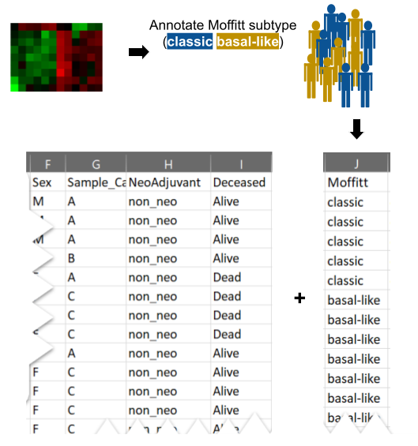

# Output Plot Types

## Navigating Output Folder

```{r, echo=FALSE, out.width="100%", fig.align = "center", fig.show='hold', fig.cap="Hourglass Output Folder Hierarchy."}
knitr::include_graphics(c("images/output_overview.png"))
```

todo: Video tutorial

## Descriptions

1. **Heterogeneity Barplot** 
+ Visualizes sample compositon (or expression levels within samples) in patients, indicative of intrapatient heterogeneity.
+ 
2.  **Survival Plot**
+ Determines survival outcome via plotting of Kaplan Meier curve, logrank test, and tables containing patient counts. Only performed on patients (not samples).
+ 
3.  **Paired Patient Slopegraph**
+ Enables screening of any intra-patient differences that may be reflective of heterogeneity. Points are averaged values across strata per patient. Lines connect different averages within patients.
+ 
4.  **Discrete Barplot**
+ Visualizes discrete values of a parameter in each stain, that is numeric in the input data but should be considered discrete. E.g. A parameter called "Heterogeneity Score" contains values 1-10 but should be "1", "2", .. "10".
+ 
5.  **Overview Boxplot** 
+ Screen primary data for interesting relationships for all features in one plot.
+ 
6.  **Individual Boxplot**
+ Visualizes data points for each features/parameter combination and relevant statistics from comparing strata.
+ 
7.  **Profile Barplot**
+ Compare set of markers across different strata for each patient/sample.
+ 
8. **Expression Heatmap**
+ Provides overview of patterns in stain data. When there are no NA/missing values (in imputed version for example), values will be clustered using unsupervised hierarchal clustering.
+ 
9. **Fold-change (FC) p-value Heatmap**
+ Screen for patterns of fold-changes between strata in comparisons and overall significance seen in individuals boxplots. Fold-changes of strata are shown as color gradient and significance between two groups are presented as stars/numbers.
+ 
10. **Correlation Plot**
+ Provides correlations between cell communities and their interactions, e.g. of an insight that can be drawn: correlations between fibroblast markers in one cancer subtype and anti-correlated with immune cells in another. Can only be performed on imputed (no missing values) dataset.
+   
11. **Correlation Scatter Plot**
+ Provides details of correlations, such as regression, scatter plots, correlation coefficients and significant and histograms of values used. Can only be performed on imputed (no missing values) dataset.
+  
12. **ID Table** 
+ Provides sample/patient ID and strata used in comparison, useful for custom comparisons (where groups are assigned by Hourglass) and to see which samples/patients were included after filter inclusion/exclusion.
+ 

## File Information and Location

See table below for details about the output files in the Hourglass output folder hierarchy.

Note for Folder Path:   

>* 0 = main output folder created by Hourglass in working directory, YYMMDD Hourglass, where YYMMDD = date of run, e.g. 260721 (Jul 21, 2026).   
* 1 = BySample, BySample imputed, ByPatient, ByPatient imputed.  
* 2 = comparison name, e.g. Sex.  
* 3 = feature set name, e.g. Tcell markers.  

Note for Filename: 

>* [comparison] = e.g. Sex.  
* [feature] = e.g. IL6.  
* [parameter] = e.g. Num.Positive.Pixels.  
* [feature set] = e.g. Tcell markers.  

| Plot | Folder Path | File Name | R Function |
|:- |:--- |:--- |:-- |:- |:-|
| Heterogeneity Barplot | 0/BySample/2/ | [comparison]_samples.pdf |```plot_het_barplot()```|
| Survival Plot | 0/ByPatient/Survival/2/ | [comparison]_survplot.pdf |```plot_surv_curve()```|
|Paired Patient Slopegraph|0/BySample/2/Paired/ | [feature]_paired.pdf |```plot_indiv_paired()```|
| Discrete Barplot| 0/BySample/2/ and 0/ByPatient/2/ | [parameter]_discrete_barplot_full.pdf |```plot_discrete_barplot()```|
|Overview Boxplot| 0/1/2/QC Parameter/, 0/1/2/QC Feature/, 0/1/2/Feature Sets/3/ | [parameter]_boxplots.pdf, [feature]_boxplots.pdf,   [feature set]_boxplots.pdf |```plot_overview_boxplot()```|
|Individual Boxplot| 0/1/2/QC Parameter/, 0/1/2/QC Feature/, 0/1/2/Feature Sets/3/ | [parameter]_boxplots.pdf, [feature]_boxplots.pdf,   [feature set]_boxplots.pdf |```plot_indiv_boxplot()```|
|Profile Barplot | 0/1/2/Feature Sets/3/|[feature set]_profile.pdf|```plot_profile_barplot()```|
|Expression Heatmap | 0/1/2/Feature Sets/3/|[feature set]_heatmap.pdf|```plot_heatmap()```|
|Fold-change (FC) p-value Heatmap | 0/1/2/Feature Sets/3/|[feature set]_pval_FC.pdf|```make_FC.pval_df()```, ```make_FC.pval_plot()```|
|Correlation Plot| 0/1 imputed/2/Feature Sets/3/|[feature set]_corrplot.pdf|```plot_corrplot()```, ```plot_corrplotgg()```|
|Correlation Scatter Plot| 0/1 imputed/2/Feature Sets/3/|[feature set]_corrplot.pdf|```plot_corrplotgg()```|
|ID Table| 0/1/2/ | [comparison].csv ||


## Quality Control

Purpose:

*  Informs whether anything is skewed in a comparison. For example, the overall number of positive cells for that stain is higher in high groups (a problem)  
* Verify that a specific metric or data point exists for a stain  


Types of stratification (creates similar plots but different combinations):

* **By.feature**: Plot all parameters present for a feature, split by comparison

* **By.parameter**: Plot all features present for a parameter, split by comparison

Patient paired plots for by sample comparisons can also be used for quality control. How? 


todo: create generic boxplot for Gene1 multiple params vs Param1 multiple features to illustrate.

## Feature Sets

Purpose: 

* Look at stains in context of other stains within the dataset  
  
**Step 1: Specify relevant parameters for each stain.**  

If multiple parameters are present per feature (usually the case in multiparametric imaging data), most will be irrelevant/for QC. The final readout is usually a ratio: (1) /(2), where (1) is quantification metric and (2) is normalization metric.
  
**Step 2: Make groups, the data integration step.**  
 
Look at a stain in context of other stains within the dataset. Make smaller groups (e.g. T cell, immune, stromal cell features).

Multiple plot types are supported for feature sets. 

groups (from comparison from row annotations) = e.g. Smoker-Yes, Smoker-No

