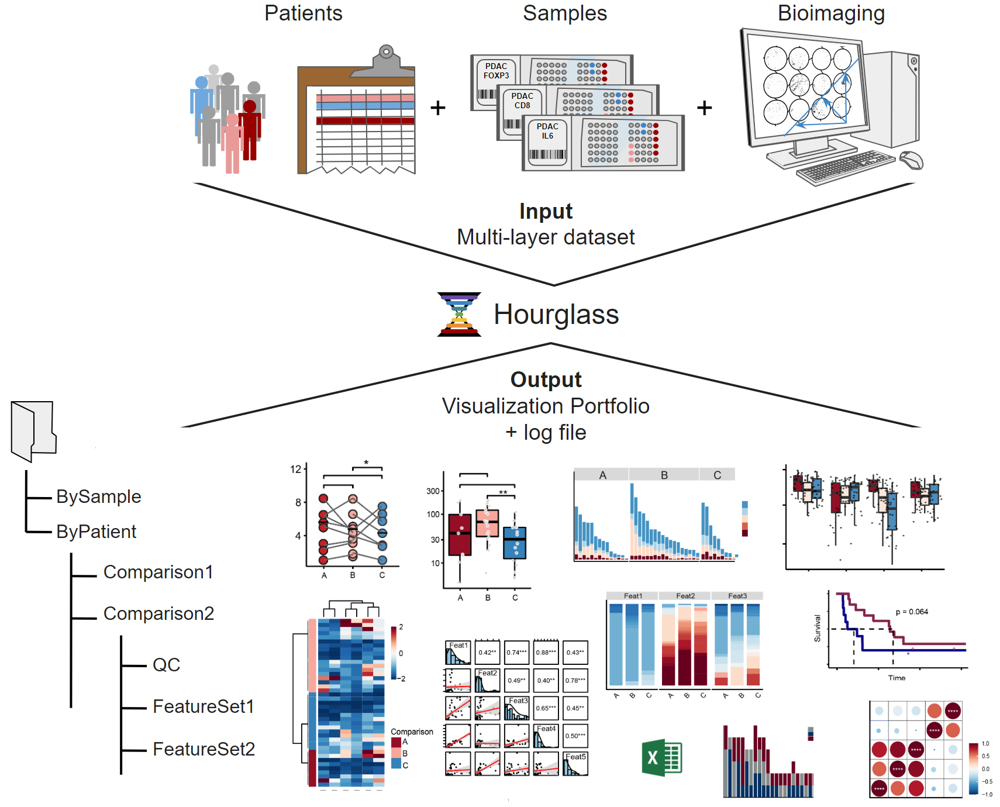
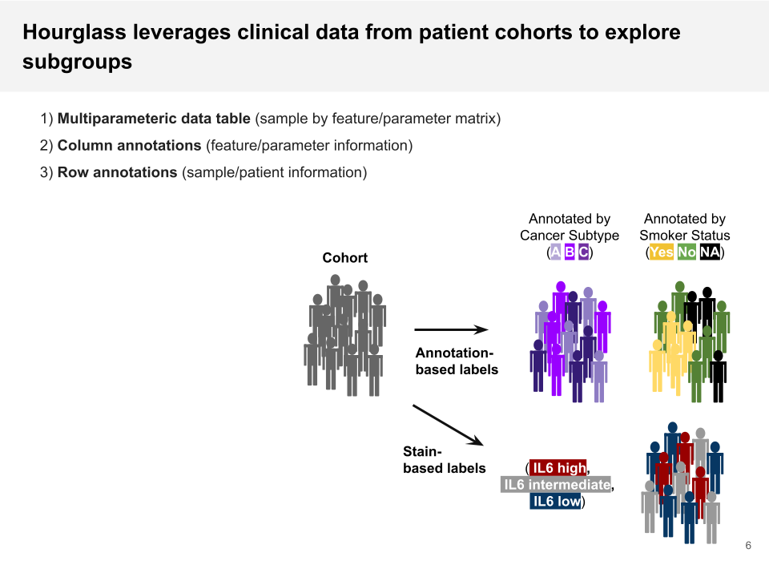
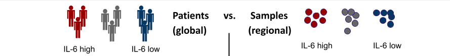
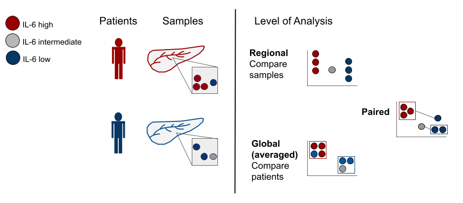
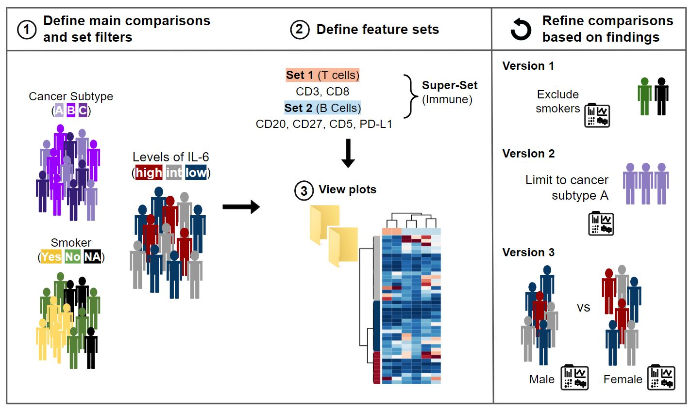

--- 
title: "User's Guide for Hourglass"
author: "Written by Kazeera Aliar"
site: bookdown::bookdown_site
documentclass: book
output: bookdown::gitbook
description: "This is the official documentation for Hourglass - learn how to install and utilize the tool."
---

# Preface

This is the official guide for **Hourglass**, the software tool to systematically interrogate multiparametric datasets in a semi-automated manner. It allows users to filter/subset datasets and perform analysis at the global, regional and patient-paired levels to identify communalities and differences. 

```{r, echo=FALSE, fig.align = "center", out.width="10%", fig.show='hold', fig.cap="The Hourglass logo."}
knitr::include_graphics(c("images/Hourglass_logo-removebg.png"))
```
  
Hourglass exists as an open-source desktop application for Windows/MacOS and a stand-alone R package. Please refer to our [link](https://www.biorxiv.org/content/10.1101/2022.09.12.507618v2) manuscript for more information.  

```{r, echo=FALSE, fig.align = "center", out.width="50%", fig.show='hold', fig.cap="The Hourglass concept: input data, computational processing, output graphs."}
knitr::include_graphics(c("images/Hourglass_art.png"))
```
  
  
  
**Acknowledgements**

We are ready to share Hourglass with the world. It's about _time_.

First of all, I would like to thank Dr. Barbara Grünwald, whose role cannot be overstated. She is the phenomenal force who helped conceptualize this toolbox and drove this project forward. It started off as a script, with 200 lines of code in a single _for_ loop, and progressively grew bigger as we added more stains and figured out new ways to interrogate the data. 

Next, I would like to thank Henry Waterhouse, who built the graphical user interface with me, from planning to launch. Bowen Zhang and Parinaz Nasr Esfahani supported software development and testing for the MacOS version. Foram Vyas, Emily Poulton, and Nathan Chan are the image analysis experts who quantified the IHC data and consistently offered creative feedback. I would like to thank my supervisor, Dr. Rama Khokha, Dr. Niklas Krebs, the Khokha Lab ([https://khokhalab.ca/](https://khokhalab.ca/)) and collaborators, for contributing and sharing their excitement about Hourglass.

I also would like to thank the developers of R, python, and Kivy for facilitating the creation of Hourglass, the StackOverflow community for having answers to all our questions, Github for providing a platform in which this program is easily accessible, and RStudio for creating R markdown and bookdown to facilitate the making of the R package and this book. 

\- Kazeera
   
  
**Contributors**  
  
```{r, echo=FALSE, out.width="75%", fig.show='hold'}
knitr::include_graphics(c("images/contributors1.png","images/contributors2.png"))
```
  
  
**Source Code for Book**  
See Github repository ([link](https://github.com/kazeera/Hourglass-book)).
  
  
**Contact Us**  
Open a new issue on Github ([link](https://github.com/kazeera/Hourglass/issues)).

<!--chapter:end:index.Rmd-->

---
site: bookdown::bookdown_site
output: bookdown::gitbook
documentclass: book
---
# What is Hourglass?

## tl;dr

**What is it?** 

   Software tool to facilitate exploration of multi-parametric data (especially bioimage quantification).
   
   
**For who?**

  Individuals who need data plotted hands-free.
  
  
**How?** 

   Provide user preferences to filter and subset large datasets and compare groups in an automated manner.
   
## Roadmap
```{r, echo=FALSE, fig.align="center", out.width="100%", fig.cap="Schematic depicting Hourglass pipeline. Top: Collecting data. Middle: Hourglass. Bottom: Output visualizations in structured folder hierarchy."}

```
  
## Is this tool for me?

**What is it optimal for?**  

* Multiparametric data analysis  
* Systematic data interrogation  
  + Explores multiple groups  
  + Wide range of plotting functions  
  + Method of quality control  
 

**What can it do, but is not optimal for?**  

* Omics visualization, i.e. any numeric dataset with annotations


**What can it not do?**  

* Integration of multiple independent datasets, _e.g._ can't compare proteome vs transcriptome
* Image analysis, _i.e._ read and interpret raw image files

## Terminology

* **Annotation** = any discrete label or description for features/parameters and patients/samples. See [Input Data] for more information. 

  * Patient or sample annotations are another layer of data that we can add to an already multi-parametric data.
   
```{r, echo=FALSE, out.width="56%", fig.align="center", fig.cap="Patients have different labels or 'annotations'."}

```

* **Feature** = stains, genes, markers, etc (_e.g._ Gene1, ProteinX, IL6)
* **Parameters** = readouts, measurements of features (_e.g._ Numbers of Positive Pixels, Percent Positive Pixels, Stained Area mm^2,Total Area mm^2)

```{r, echo=FALSE, out.width="90%", fig.align="center", fig.cap="Columns in stain data can also have labels or 'annotations'."}
knitr::include_graphics("images/features_vs_parameters2.png")
```

* **Multiparametric** = data with more than two dimensions, results from multiple parameters being measured from features. For example, from methods such as Immunohistochemistry (IHC), immunomasscytometry (IMC), etc.  
  
If we look at the feature IL6, using bioimage analysis tools, we can measure many readouts from one feature, such as: 
 IL6 -->  Number of positive pixels AND
     Area AND
     Positive Pixel percent

* **vs. Uniparametric** = data from methods such as microarray, transcriptomics, proteomics, etc.

If we look at the same feature IL6, using traditional omics, we get a single readout from one feature, such as: 
 IL6 --> protein abundance OR
	    gene expression


## By-Patient vs. By-Sample
In addition to enabling a highly systematic visualization of multiple research questions within the integrated dataset, Hourglass is designed to enable this structured analysis across multiple levels. Specifically, Hourglass is designed to leverage the fact that bioimaging datasets are typically recorded from  multiple samples per patient. For example, TMAs comprise multiple samples per patient while IMC and spatial omic methods usually record multiple regions of interest (ROIs) per patient.

```{r, echo=FALSE, out.width="100%", fig.align="center", fig.cap="Hourglass can compare annotations at the patient or sample level."}

```

Hourglass accesses all levels of this unique data structure: ROIs/samples per patient may be averaged for by-patient analysis, run in parallel as individual sample analysis and, furthermore, be aggregated as patient-matched samples. Hourglass thereby accelerates exploration and direct comparison of regional versus global versus patient-paired features for each patient, providing a comprehensive overview over inter- and intratumoral stain differences.

The multiple levels are (see below for description): 

```{r, echo=FALSE, out.width="100%", fig.align="center", fig.cap="Patients have different labels or 'annotations'."}

```

1) **Global/ByPatient**: Typically, TMA-derived datasets comprising multiple samples per patient are averaged. Because there are multiple samples per patient, common practice is to collapse to a patient level by averaging samples across patients commonly done for this type of dataset on a by-patient basis. Collapsing our dataset resulted in patient x feature-parameter matrix dimensions of 165 x 631, with a total of 104,115 data points. For example, we could now compare IL6 hi vs IL6 low patients.

2) **Regional/BySample**: This analysis is performed to figure out when intratumoral heterogeneity can be increasingly appreciated as a key factor in X. We saw a specific opportunity to dissolve those regions and look at heterogeneity across samples, so this is a specific angle that we implemented in Hourglass. For example, IL6 hi vs IL6 low regions across all samples.

3) **Patient-Paired**: To analyze intrapatient heterogeneity, Hourglass can also create slopegraphs to resolve regional differences in a patient-paired manner. For example, for comparison of IL6 hi vs IL6 low regions within the same tumors. Hourglass averages the values and plots a graph in which the means of each group are paired. For example, tumor subtypes may vary across samples or ROIs in the same patient. If four samples from a patient are tumor subtype A and three are B, the means of these 2 groups are connected directly by a line and this comparison can be statistically assessed for all patients.

These different analysis levels can be utilized alone or in combination, i.e. the user can easily focus on standard per-patient analysis only or perform the analysis under identical settings at the global, regional and patient-paired levels to systematically identify communalities and differences. For example, if regional differences are driving global trends then we know that either or both heterogeneity and sampling bias is relevant in this research question.


## Comparisons and Feature Sets

```{r, echo=FALSE, out.width="100%", fig.align="center", fig.cap="The Hourglass Workflow (left to right)."}

```

**Hourglass enables versions of comparisons**  
Multiple versions of an analysis can be submitted in parallel to the same Hourglass run, enabling direct comparison of the results. In the case of a main comparison of  IL6 high vs IL6 low patients, the user can submit additional versions of this analysis to directly compare if IL6-related differences could be sex-specific or subtype-specific. 

When interacting with their data, users can thereby easily focus on different parameters and biological differences while having fixed analysis settings (same feature sets, correlation method, two-tailed p-value test). This facilitates systematic recognition and investigation of side/sub-correlations or confounding factors that may have otherwise been overlooked. Consequently, Hourglass provides automated large-scale integrated analysis with and without inclusion of different subgroups of patients or samples. This allows users to gain a quick and comprehensive overview of how different subgroups might be affecting their results. 


**Hourglass enables targeted analysis and grouping of feature sets**  
Often-times a dataset may contain features that are not of interest to a specific question or, related to this, sets of features that are biologically related (_e.g._ T cell stains CD3, CD8, FoxP3). 

Thus, extensive analysis customization options were implemented in Hourglass. This optional analysis step allows for related parameters and features to be grouped together in composite plots, which is referred to as 'feature sets'. For example, users may define T cell and B cell marker sets (set 1 and 2). Users can then furthermore create super-sets from sets, such as "immune markers" from B cell and T cell sets, to be displayed in custom composite plots as depicted in the heatmap. Any combination of features and parameters can be used to create a set, which enables easy but powerful customization of the numerous and partially related features within complex datasets.


**Hourglass was designed to take in a general data format with user options and instantaneously generate a wealth of information.**

The power lies in the **manipulation of both axes** of a numeric sample by feature matrix:

1) the labeling and filtering of rows (patients/samples), and 
2) the subsetting of columns (features/parameters) 

Any label that is assigned to patients can be used as a main comparison. For example, in an Hourglass-independent manner, annotations for patients can be derived from transcriptomic data such as Moffitt subtypes or genomic calls such as KRAS wild-type vs KRAS mutated. On the other axis, biologically relevant features and corresponding parameters can be grouped to make feature sets such as T cell markers and immune markers. Consequently, by compounding multiple sets with multiple sample or patient comparisons, the potential for data exploration is exponentiated.
 
```{r, echo=FALSE, out.width="50%", fig.align="center",fig.cap="New annotations can be added prior to running Hourglass. For example, transcriptional profiles of pancreatic cancer can be used to determine Moffitt molecular subtype."}
knitr::include_graphics("images/making_row_annotations.png")
```


## Strengths
There are multiple benefits of using Hourglass as a framework for multiparametric dataset interrogation.


**Accessibility**

* Accessible for non-expert users, fully reproducible and open-source.
* Makes publication-ready plots via robust and automated pipeline reduces manual work.
* Leverages metrics of heterogeneity from standard tissue microarray designs.

**Query and Exploration**

* Customizable and endless combinations of selections of what labels/annotations to compare. Thus, multiple layers of information from TMAs are extracted but can only be understood or interpreted via a smart way of visualizing the data to make sense of it. Hourglass is the tool to subset, integrate, and pick specific parameters to appreciate all of the information from a dataset.

* Different levels of analysis (global or by patient vs regional or by sample) can be run. Common practice is to average these values and collapse by patient, however a wealth of information is contained in the sample data and intra-patient differences.

* Resolves regional vs global differences via paired analysis and heterogeneity barplots. Multiple layers of information from TMAs are extracted but can only be understood or interpreted via a smart way of visualizing the data to make sense of it.

**Reproducibility**

* As the nature of such analyses is iterative, and users often return to refine or add to an analysis after extended periods of time, Hourglass supports a high level of reproducibility. 
* Each analysis produces a report (Excel file) sufficient to easily reproduce that analysis and also produce different additional versions of that analysis with identical settings.

**Data cleaning and wrangling**

* Subset input table with all parameters to be compared  
* Filtering - Incorporates exclusion/inclusion criteria, within subgroups. For example, a researcher may want to exclude certain patient subgroups or focus on a subset of a 40 stain panel or pre-treated patients may be excluded to observe the effects of basic biology.
* Imputation for dropouts. Often, datasets are patchy containing NA values.
* Supports removal of outliers below the first quartile and above the third.

## Limitations
Hourglass facilitates efficient knowledge extraction from complex datasets. However, it does have certain weaknesses. 

**Minimum number of stains for it to be useful**

* It is not useful when you have 5 samples and one stain/ typical use case when you have the two. You can still benefit from subsetting.
* Feature sets have to contain 3 or more features in order to be visualized.

**Time commitment**

* While Hourglass automatically creates publication-ready plots, it is still semi-automated, the "semi" meaning that you as a user are required to do some work. Firstly, Hourglass requires user tailors its input parameters to guide the analysis. Next, hundreds to thousands of plots will be created. While you may be swimming in a pool of beautiful plots, it may become tedious to look through all the files. However, the organized file output structure seeks to mitigate this through order of folder names: By Patient/By Sample > Imputed or not > Comparison > Feature Set 

<!--chapter:end:01-intro.Rmd-->

---
site: bookdown::bookdown_site
output: bookdown::gitbook
documentclass: book
---
# Installation

## Install R
> Note: R is a statistical environment / programming language used by Hourglass. R must be installed for the application to work, but working knowledge of R programming is not necessary.

For **step-by-step installation instructions**:  

* Install R & rtools for Windows  [link](https://datag.org/resources/documents/spring-2018/37-de-barros-installing-r-on-windows/file).   
* Install R for Mac  [link](https://people.umass.edu/biep540w/pdf/HOW%20TO%20install%20R%20and%20R%20Studio%20MAC%20Users%20Fall%202020.pdf).  


For **shorter installation instructions**:  

* Install R
     * Follow [download link](https://cran.r-project.org/bin/) on website for your operating system. 
     * For Windows, install both R from _base_ folder and Rtools from _Rtools_ folder. 


* Install RStudio _(optional)_
     * RStudio is an integrated development environment (IDE) for R that provides an alternative interface to R.
     *  Download community/open-source version for free on website [link](https://rstudio.com/products/rstudio/download/#download).

## Install Desktop Application
> This step is for users who prefer to use Hourglass as a standalone application for a graphical user interface.

**Windows**  
i. Click [here](https://github.com/kazeera/Hourglass-interface).  
ii. Download the exe file.  
iii. Open in your local Downloads folder and run the file installer by double clicking on it.  
iv. Select Desktop shortcut option to have it appear on the desktop.  
  
**MacOS**  
i. Click [here](https://github.com/kazeera/Hourglass-interface).  
ii. Download the dmg file.  
iii. Drag contents of dmg file to Applications folder.  
  
When you run Hourglass for the first time in the desktop application, it will install the R package.

## Install R package (optional)
> If you are familiar with R programming, Hourglass can be used as an R package independently. Note: It will be installed when running Hourglass application the first time.

i. Open up R console.
ii. Copy and paste these commands to install the package in R. 

```
install.packages("devtools")
devtools::install_github("kazeera/Hourglass")
```
See [How to Use the R Package] for more information.
Click [here](https://github.com/kazeera/Hourglass) for source code on Github.

## Uninstall

Follow instruction if you would like to uninstall Hourglass:

**Uninstall application on Windows:**  
Option 1. Go to Add or Remove programs. Search for Hourglass. Press uninstall.  
Option 2. Open folder where Hourglass was installed (usually in Program Files). Double-click on file called "unins000.exe" to uninstall.  

**Uninstall application on MacOS:**  
Delete Hourglass application by clicking on icon and "Move to Trash".  

**Uninstall R package:**   
Open R console and enter the following command:
```
remove.packages("Hourglass")
```

## Troubleshooting

* **Error**: package or namespace load failed for 'stats' in inDL(x, as.logical(local), as.logical(now), ...):
LoadLibrary failure: The specified module could not be found.
* **Solution**: Go to where R is located and delete the .Renviron file.

<!--chapter:end:02-installation.Rmd-->

---
site: bookdown::bookdown_site
output: bookdown::gitbook
documentclass: book
---
# Input Data 
## File Format
Hourglass currently supports input data as *csv* (comma separated values) and *txt* (tab-delimited text) files

Requirements

* All files should have row and column names.
* Missing values should be denoted NA or left blank (not nan, N/A, "NA")
* Avoid special characters, such as /,\\,+,-,^ in column names. Use descriptive names with underscores (_i.e._ \_) or periods (.).

## The 3 Files

**Your dataset comprises of 3 tables or files:**

The file descriptors are named below with abbreviations in brackets. For R package users, these are names of elements in the _dataset (ds)_ list object.

```{r, echo=FALSE, fig.cap="Snippet of the three files/tables required for Hourglass: 1) values matrix, 2) metadata/annotations for columns of values matrix, and 3)  metadata/annotations for rows of values matrix."}
knitr::include_graphics("images/input_files.jpg")
```

**1. Numeric matrix (referred to as 'numMat'/'vals')** 

= Numeric values from quantification, where rows (samples/patients) x columns (genes/features/parameters). For best output results, columns should contain feature first name with a period to delimit the rest of the column name. (_e.g._ try "Gene1.Parameter", not "Gene1_Parameter"); for heatmaps/correlation plots, the part of the column name after the period will be removed by Hourglass.

For example, for RNA sequencing data: data matrix = expression matrix, columns = genes, rows = samples.


**2. Column Annotations (or 'colAnn')** 

> Annotations/descriptors for columns in numMat. At least two columns are needed for "Feature" and "Parameter" (can be called something else). 

= Feature/parameter information, describes the columns of numMat. First column must be the column names of numMat.

* Descriptive columns names in data (recommended), e.g. feature_parameter
* For example, for the column "IL6.Number.of.Positive.Pixels", the feature is IL6 and parameter is Number.of.Positive.Pixels. For the column "Gene1_woo_ahaha_Area", the feature is Gene1 and parameter is Area, which will be reflected in the colAnn columns.
* Hourglass also subsets columns based on a column called "Keep.In.Analysis" - TRUE to keep, FALSE to discard. 

**3. Row Annotations (or 'rowAnn')**

> Annotations/descriptors for patient/sample in numMat

= Sample/patient information, describes the rows of numMat. First column must be the row names of numMat. 

These are labels or groups that will define main comparisons or groups to compare or for exclusion/inclusion of patients/samples (e.g. removing smokers)
 
Examples

* For samples:
     * Tissue type
     * Sample_Cancer_Subtype

* For patients:
     * Patient_Cancer_Subtype
     * Smoker
     * Age at diagnosis

A column for "Patient_ID" is required (can be called something else) for paired analysis (_i.e._ averaging samples from the same patient) and patient level analysis (_i.e._ averaging samples from the same patient).

> Note: this is external information from clinical charts / prior analysis that is integrated manually prior to running Hourglass. This means transcriptomic, genomic, and clinical calls are created independently of Hourglass and merged to the master rowAnn table via sample or patient identifiers.  


## Similar Format
The data input was inspired by popular bioinformatics packages, with numeric data plus metadata. 

* Struct is a package in which a simple DatasetExperiment object contains sample measurements, sample metadata, variable metadata. [Figure 1 here](https://academic.oup.com/bioinformatics/article/36/22-23/5551/6039109).
* SingleCellExperiment object contains primary and transformed data (cell x feature matrix) and reads in feature and cell metadata. This is similar to Hourglass running the original and imputed versions in the same run. [Figure 4.1 here](http://bioconductor.org/books/3.13/OSCA.intro/the-singlecellexperiment-class.html).
* SummarizedExperiment object similarly contains multiple assays (feature by sample matrices) with colData and rowData. [Section 2 here](http://bioconductor.org/packages/release/bioc/vignettes/SummarizedExperiment/inst/doc/SummarizedExperiment.html).

## Example Dataset
We included an example multiparametric dataset with annotations for patients/samples. This is an **entirely fake dataset**. 

Its purpose is to showcase the functionalities of Hourglass and help users recreate plots seen here. These values have no biological relevance or connection to literature. Parameters and annotation labels were inspired by the quantified immunohistochemistry dataset for pancreatic cancer tissue microarray.

**Features of example dataset**

* 30 patients with 1-6 samples per patient
* 102 samples in total (rows)

**Features**

The following stains (referred to as "features" see [Terminology]) were quantified:	

* CD3, CD8 (which are T Cell markers)
* CD20, CD27, CD5, PDL1 (B Cell markers)
* IL6, SMA (other)

**Parameters**

The parameters measured for each feature are:

* **Area** = area of tissue image in mm^2 (random)
* **Num_Detections** = number of detected pixels on tissue area = Num_Positive + Num_Negative
* **Num_Negative** = number of pixels of negative staining (random)
* **Num_Positive** = number of pixels of positive staining (based on trends), affects the following: 
     * **Positive_Percent** = Num_Positive / Num_Detections x 100
     * **Negative_Percent** = 100 - Positive_Percent 
     * **Pos_Pixel_Percent** = Num_Positive/10^3  x random value from 0.3 to 1.5 
     * **Num_Pos_per_mm_2** = Num_Positive / Area x 10^4
     
**Possible Feature Sets**

* **_TCell_** = CD3, CD8  
* **_BCell_** = CD20, CD27, CD5, PDL1  
* **_Immune_** = TCell, BCell  
* **_All_** = Immune, IL6, SMA  

**Possible Feature Parameters**

* Num_Pos_per_mm_2
* Pos_Pixel_Percent

**Summary of Trends**

Most values differ/segregate based on 3 sample cancer subtypes (A, B and C). When there are more than 2 samples per patient, there is a predominant "Patient Cancer Subtype" but some samples might deviate from this (ie. intrapatient heterogeneity).

The following trends are:

* Overall survival is low for A, medium for B, high for C
* Average values for TCell (overall low) vs. BCell (overall high)
* Only for TCells:  
     * Het.Score low for A, medium for B, high for C
     * Smokers for all subtypes for TCell stains are high
* Only for BCells:  
     * NeoAdjuvant values are lower
* IL6 different between A,B,C subtypes only seen in females ("Sex==F")
* No trend in SMA
* Random outliers (very high value, 4 per row) and random NAs (8 per row)


**How to Access Files**

Download 3 csv files [here](https://github.com/kazeera/Hourglass/tree/main/example/ExampleData2), file names:

* "Example_IHC_sample_colAnn.csv" (colAnn)
* "Example_IHC_sample_rowAnn.csv" (rowAnn)
* "Example_IHC_sample_vals.csv" (numMat)  

A corresponding example analysis that is the output of the desktop application, serves as the log file for user options and serves input into the R side (See [Output: Excel File] can downloaded found [here](https://github.com/kazeera/Hourglass/blob/main/example/Example_IHC_sample_UserOptions.xlsx)).

**How to Access in R**

See [Example Dataset in R].

<!--chapter:end:03-input.Rmd-->

---
site: bookdown::bookdown_site
output: bookdown::gitbook
documentclass: book
---
# How to Use the Desktop Application

Before starting, ensure R is installed (and rtools for Windows), see [Install R]. To check, open the R terminal and type the following command to see where R is located on your computer: 
```
.libPaths()
```
Next, install the desktop application. See [Install Desktop Application].

## Basic Workflow

> Note: we use the term "graphical user interface" interchangeably with "desktop application". 

Open the application to begin. Double-click on its icon:
```{r, echo=FALSE, out.width="10%", fig.align = "center", fig.show='hold'}
knitr::include_graphics(c("images/Hourglass_logo-removebg.png"))
```

The graphical user interface (GUI) contains sequential tabs taking users step-by-step through the Hourglass algorithm. Each tab contains options to relay data to the R package and customize Hourglass output. GUI tabs and key user events are described here.

Note: Hold and drag tabs at the top to scroll. Click on the tab name to access section.

* [Upload Files] (See [The 3 Files] for formatting)
* [Define Comparisons] of interest (row annotations)
* [Define Feature Sets] and pick relevant parameters (column annotations)
* [Customize Colors] for comparison subgroups
* [Advanced Options] for statistical tests, imputation, surival analysis, etc.
* [Run Hourglass] to create all plots with one click

```{r, echo=FALSE, fig.align = "center", fig.show='hold', fig.cap="Overview: all tabs."}
knitr::include_graphics(c("images/app/GUI_0_overview.png"))
```


## Welcome

> This tab briefly explains the overall workflow.

No actions are required by the user. Press the next tab "Upload Files" to start.

```{r, echo=FALSE, out.width="66%", fig.align = "center", fig.show='hold', fig.cap="Welcome."}
knitr::include_graphics(c("images/app/GUI_1_welcome.png"))
```


## Upload Files

> This tab specifies input data paths that will 1 - customize the user's experience (in this application) and 2 - be used in Hourglass analysis runs.

1. Enter the name of your dataset in text input field ("Enter Text Here").
2. Use "Choose File" buttons to upload the required 3 data files from your computer, specifically:
* **numMat** - numeric matrix file 
* **rowAnn** - row annotations (clinical and sample descriptions)
* **colAnn** - column annotations (feature and parameter descriptions). 

Check [The 3 Files] for table formatting details and supported file types.

```{r, echo=FALSE, out.width="66%", fig.align = "center", fig.show='hold', fig.cap="Upload data."}
knitr::include_graphics(c("images/app/GUI_2_upload-data1.png",
                          "images/app/GUI_2_upload-data2.png"))
```

Note: To upload, press on button and it will open a file chooser with this appearance: 

```{r, echo=FALSE, out.width="66%", fig.align = "center", fig.show='hold', fig.cap="File/Folder chooser view."}
knitr::include_graphics(c("images/app/GUI_2_upload-data3.png"))
```

To go into a folder, double-click on its icon. 
  
To go back up a folder, double-click on the first folder denoted "../". It looks like this:
```{r, echo=FALSE, out.width="10%", fig.align = "center", fig.show='hold'}
knitr::include_graphics(c("images/app/GUI_2_upload-data4_go-back.png"))
```


## Define Comparisons

> This tab creates a table of "comparisons" on how to stratify patients or samples. Each comparison/row will be run independent of other comparisons.

```{r, echo=FALSE, out.width="66%", fig.align = "center", fig.show='hold', fig.cap="Pick comparisons."}
knitr::include_graphics(
  c("images/app/GUI_3_pick-comparisons1.png", "images/app/GUI_3_pick-comparisons2.png")
)
```

1. Select "Patient ID" from the drop down menu displaying rowAnn column names. It will be used to group samples belonging to the same patient in By Patient analysis and patient-paired slopegraphs. Skip this step if patient-level analysis is not required.

2. Press the **"Add a comparison"** button to add a new comparison and fill in the option fields:

> Note: All text input fields are case-sensitive, _i.e._ must match data.

**Main or Custom Comparison**

* Define a comparison for each row (required), by **either**:
     * Selecting a "Main Comparison" from the drop down menu displaying rowAnn column names (e.g. smoker, age group) 
     * Filling "Custom Comparison" - type in the exact column name of a variable from numMat (feature+parameter e.g. IL6_num.positive.pixels) or from rowAnn (e.g. age)

* Customize comparison with optional fields:

**Subgroup**

Select a "Subgroup" from the drop down menu displaying rowAnn column names (e.g. smoker, age group). This is only for a secondary color coding of dots in boxplots and an extra annotation color bar in heatmaps.
{insert 2 boxplot images with and without colored dots} 

**Within Group**

This will run Hourglass within groups or cohorts of sample/patients.
Append rowAnn column names with ",". 
e.g. Sex,Smoker

**Filter**

Specify exclusion criteria with this format: rowAnn_columnname != variable to exclude or rowAnn_columnname == variable to keep.
e.g. Smoker=="Yes" - this keeps all smokers and excludes all other samples/patients from analysis. Ensure that "Smoker" is a column in rowAnn and "Yes" is one of its column values. Choose multiple filters by appending filters with ";", e.g. Smoker=="Yes";NeoAdjuvant!=neo

**By Sample**

Check box to create plots from original input files, treating each row in numMat as an individual data point. 

**By Patient**

Check box to average across Patient ID (see below) and create plots.

> Note: at least one of By Sample or By Patient must be selected for comparison to run.


Example of a comparison:

| Field | Value | Description |
|:-- |:-- |:-- |
| Main comparison | | Since main comparison is empty, custom comparison must be defined |
| Custom comparison | IL6_Number.Positive.Pixels | Compare IL6 high vs low groups (# intermediate depends on the "Number of custom levels" in Advanced Options tab) |
| Subgroup | Smoker | Color code boxplot dots by Yes or No (values in Smoker column) |
| Within Group | Sex;Smoker | Run Hourglass for all samples/patients. Then rerun within male cohort and female cohort. Run within Smoker-Yes, then Smoker-No cohort.| 
| Filter | NeoAdjuvant != neo | Before running this comparison, remove all samples/patient rows that are "neo". |
| By Sample | (checked) | Run this comparison at the sample-level. |
| By Patient | (checked) | Run this comparison at the patient-level (average the multiple samples per patient). | 

## Define Feature Sets
> This tab allows users to pick biologically relevant parameters for each feature and group them as feature sets.


**Tab 1: Select columns**

* Select column name from colAnn for Feature and Parameter columns.

* Recall [Terminology]: 

+ **Feature** = stains, genes, markers, etc (e.g. Gene1, ProteinX, IL6), while 

+ **Parameters** = readouts, measurements of features (e.g. Numbers of Positive Pixels, Percent Positive Pixels, Stained Area mm^2,Total Area mm^2).

```{r, echo=FALSE, out.width="66%", fig.align = "center", fig.show='hold', fig.cap="Select columns for feature sets."}
knitr::include_graphics(c("images/app/GUI_4_1_select-columns2.png", 
                          "images/app/GUI_4_1_select-columns2.png"))
```

**Tab 2: Define parameters**

* Using drop-down menus, pick relevant parameters for each feature (called standard) and optionally, an alternative.

* Note: this will populate the table/sheet in the output Excel file called Feature Parameters.

```{r, echo=FALSE, out.width="66%", fig.align = "center", fig.show='hold', fig.cap="Define feature set parameters."}
knitr::include_graphics(c("images/app/GUI_4_2_pick-params1.png", 
                          "images/app/GUI_4_2_pick-params2.png"))
```

**Tab 3: Define sets**

* Next, define feature sets. Press the "Add a row" button to add a new set. 

+ **Name of group**: Type in a name for group, e.g. T_cell_markers.

+ **List of features**: Type in a list of features (see Tab1 for options) or group names, appended with comma. 

        - The delimiter must be a comma, leading and trailing whitespace will be ignored.
        - Minimum of 3 features.
        - Case-sensitive.

```{r, echo=FALSE, out.width="66%", fig.align = "center", fig.show='hold', fig.cap="Define feature sets."}
knitr::include_graphics(c("images/app/GUI_4_3_define-sets1.png", 
                          "images/app/GUI_4_3_define-sets2.png"))
```

Example of feature sets:

| Group Name | Group List | Alternative | 
|:-- |:-- |:-- |
| TCell | CD3, CD8 ||
| BCell | CD20, CD27, CD5, PDL1 ||
| immune | TCell, BCell ||
| all | immune, IL6, SMA ||

+ **Alt** (Alternative): Select "Alt-Yes" to run this set with standard AND alternative parameters separately, or "Alt-No" for a run with standard parameters. 

Note if "Alt-Yes" is selected, there will be two folders for a feature set, one with the original name and another with "_alt" appended, e.g. "TCell" for standard parameters and "TCell_alt" for alternative. 

Note: this will populate the table/worksheet in the output Excel file called Feature Sets.

## Advanced Options
> This tab includes customization for statistics, plot types, etc. 

```{r, echo=FALSE, out.width="66%", fig.align = "center", fig.show='hold', fig.cap="Define feature sets."}
knitr::include_graphics(c("images/app/GUI_5_adv-options1.png", 
                          "images/app/GUI_5_adv-options2.png"))
```

Labels for options are on the left and drop down menus on the right side:

* **Correlation method**: Method for correlation between two variables. Options are "pearson" (linear relationship using raw data), or"spearman","kendall" f(monotonic relationship using ranked data).

* **Test method**: Which two-sample test should be used? Student's t-test for parametric data, wilcoxon usually for non-parametric.

* **p-values label**: How p (significance) values are to be represented in boxplots, correlation plots, p-value/fold-change heatmap. Stars or exact numeric values.

* **Fold-change method**: Fold change computation method to use, either "divide" (for non-transformed values) or "subtract" (for log2-transformed values).

* **Color gradient**: Color palette for scaled plot types: heatmaps, correlation plots. See color palettes (visual) by pressing the button "See color gradients". 
```{r, echo=FALSE, out.width="40%", fig.align = "center", fig.show='hold', fig.cap="Color gradients supported by Hourglass - image from RColorBrewer."}
knitr::include_graphics(c("images/app/GUI_5_adv-options3_colors.png"))
```

* **Number of custom levels**: Number of intermediate groups resulting from Hourglass separating a continuous variable into low, int, high. For example, if 2 is selected, there will only be low and high groups, whereas if 4 is selected, the groups will be low, int1, int2, high. 

* **Save ID data to file**: Would you like sample/patient IDs and corresponding comparison groups to be saved to a .csv table? If TRUE is selected, then yes. This may be useful to 1) identify how Hourglass stratified custom comparisons, i.e. which patient IDs were considers low, int, high in the analysis and 2) see which samples/patients were in analysis after filtering steps.

* **Log10 y axis for box/paired plots**: Should the data be transformed (y axis) for box plots and patient-paired slopegraphs? Opt for this option if the data columns have large ranges.


Survival analysis options:

* Check box (Run survival analysis) to specify creation of survival plots.

* **Survival time column**: Time starting from a predefined point to the occurrence of the event of interest, usually OS time (overall survival time - time from diagnosis to death.

* **Censoring status column**:  Numeric event status represented by 0 and 1 for each patient, where 1 indicates the event has occurred and 1 means the status is incomplete. A patient is censored when we don't know the true survival time for that patient.

The two columns above must be in rowAnn table.


Additional options:

* **Discrete parameters**: Manually type in list of parameters (appended by ",") in numMat that are to be viewed discretely, not continuous as Hourglass assumes. _e.g._ "Het.Score" might have values from 1 to 10.

* **Remove outliers**: Check box. If selected, outliers will be removed columnwise for all runs (included imputed version) based on the IQR method. Any observations that are more than 1.5 IQR below Q1 or more than 1.5 IQR above Q3 are considered outliers and become NAs.

* **Run imputed version**:
      + Check box to run imputed analysis in parallel. This indicates that all comparisons at sample and patient level will be run Hourglass 
      + Move slider to specify the extent of imputation. Missing data points in numMat will be imputed columnwise with a random value plus or minus _x_% around the mean of each column, default is 5%.

## Customize Colors
> This tab contains buttons for each unique value in all comparisons. 

* A button for each unique value in defined comparisons will automatically be displayed. For example, if "Cancer Type" was chosen as a main comparison, corresponding buttons for lung, breast, pancreatic, and other values in the "Cancer Type" column will be displayed. 

```{r, echo=FALSE, out.width="66%", fig.align = "center", fig.show='hold', fig.cap="Customize colors."}
knitr::include_graphics(c("images/app/GUI_6_customize-colors1.png", 
                          "images/app/GUI_6_customize-colors2.png"))
```

1. Press the button to open a color picker window. Select a color by: 
     * Entering a hex code in the text input field at the bottom of the left panel.
     * Placing and clicking cursor on the color wheel.
     * Move slider.

2. Press "Select and Close Window" to save.

* If **white** (hex code #ffffffff) is chosen (center of the color wheel), that value will be excluded from all comparisons. This will bypass filters in comparisons. For example, perhaps "Sex" in rowAnn has the values "F", "M" and "X", where "X" does not have high enough patient numbers. To exclude this group, make the "Sex-X" button white.

* Press "Select" to choose colors.
Note: the information will help populate the table/sheet in the output Excel file called Colors.

## Run Hourglass 
> This tab is the final tab that defines which plot types should be created in output folder

```{r, echo=FALSE, out.width="66%", fig.align = "center", fig.show='hold', fig.cap="Run Hourglass."}
knitr::include_graphics(c("images/app/GUI_7_run-hourglass1.png", 
                          "images/app/GUI_7_run-hourglass2.png"))
```

* Check boxes for quality control boxplots, for the feature and parameter colAnn columns (optional). See [Quality Control (QC) Plots]. Note this uses information from Feature Sets Tab 1.

* Check boxes for plots that will be created for each feature set. Ensure "Feature Plots" is checked.

* **Either** press:
     * "Create output spreadsheet" button and navigate through the folder directory and save the Excel file locally. Modify if needed before pressing Run. 
     * **OR** press "Upload existing spreadsheet" and find and upload a locally existing Excel file.
      
* Finally! Press the "Run Hourglass" button which interfaces to R (back-end). Hourglass will read from the [Output: Excel File].  

This action will relay user options and data file paths to the Hourglass R package and calls on functions to run comparisons using established R plotting libraries, such as ggplot2 and pheatmap. See [Output Plot Types] for more information. An error window will pop up if there are any issues running Hourglass. 

	

## Output: Excel File
The purpose of this application is to create an Excel file that 

1) will be read into R 
2) act as a log file for run specifications

Download output Excel file template [here](https://github.com/kazeera/Hourglass/blob/main/example/Template_UserOptions.xlsx).

There are the 4 tables/worksheets:

| No. | Name | Description |
|:- |:--- |:--- |
|1| **Comparisons** | comparisons and other analysis parameters (e.g, local file paths to data, survival columns, which plots to create) | 
|2| **Colors** | color palette for values in comparisons, first column is name and second is color hex code |
|3| **Feature Sets** | named groups of features |
|4| **Feature Parameters** | standard and optionally alternative parameters for the feature sets |

> You may manually add/modify specific run parameters here. For example, it may be laborious to retype all feature sets, so if the input data is the same, you could copy/paste from a previous run/table and upload to Hourglass.

**1. Comparisons**

This worksheet contains specifications for each run. The first column must be the exact names of the user options and the proceeding columns are comparisons, where each column is a comparison. 

```{r, echo=FALSE, out.width="80%", fig.align = "center", fig.show='hold', fig.cap="Example of Comparisons worksheet in output Excel file."}
knitr::include_graphics(c("images/excel/output-excel_comparisons.png"))
```

The first rows ("MainComparison" to "ByPatient") reflect the comparison table in [Define Comparisons], while the rest are options selected from other tabs (e.g. [Advanced Options], [Run Hourglass])

**2. Colors**

This worksheet contains hex-codes for colors in comparisons (form: #123456ff, where ff means full opacity) from [Customize Colors]. For example, if Sex was selected as a MainComparison, the strata "Sex-F" and "Sex-M" will show up here.

If you'd like to **exclude an option**(e.g. "Sex-X" due to low patient number), set to white "#ffffffff" or do not include and it will be removed from all comparisons with "Sex".

This may be useful if you have high,int,low for a CustomComparison (see [Pick Comparisons] for definition) - if the intermediate group is to be excluded, delete the "Custom-int" row.

Colors are the **same for all unique strata** for consistency. For example, "Patient_Cancer_Subtype-A", "Sample_Cancer_Subtype-A", "Sex-A", "Smoker-A", "Random-A" all have the strata "A" and therefore will be the same color (ie first color defined, duplicates are ignored).

```{r, echo=FALSE, out.width="40%", fig.align = "center", fig.show='hold', fig.cap="Example of Colors worksheet in output Excel file."}
knitr::include_graphics(c("images/excel/output-excel_colors.png"))
```

**3. Feature Sets**

This worksheet contains the table in [Define Feature Sets] "Tab 3: Define sets". 

```{r, echo=FALSE, out.width="68%", fig.align = "center", fig.show='hold', fig.cap="Example of Feature Sets worksheet in output Excel file."}
knitr::include_graphics(c("images/excel/output-excel_feature-sets.png"))
```


**4. Feature Parameters**

This worksheet contains the table in [Define Feature Sets] "Tab 2: Define parameters". 

```{r, echo=FALSE, out.width="60%", fig.align = "center", fig.show='hold', fig.cap="Example of Feature Parameters worksheet in output Excel file."}
knitr::include_graphics(c("images/excel/output-excel_feature-parameters.png"))
```

<!--chapter:end:04-app.Rmd-->

---
site: bookdown::bookdown_site
output: bookdown::gitbook
documentclass: book
---
# How to Use the R Package

We constructed new functions and compiled relevant individual data filtering functions (such as subset retrieval, imputation and outlier removal) and plotting functions (such as boxplot, heatmap, correlation matrix, survival plot visualizations).

## Outline of Code

```{r, echo=FALSE, out.width="90%", fig.align = "center", fig.show='hold', fig.cap="Workflow: Order of functions in Hourglass R package."}
knitr::include_graphics(c("images/R_functions.png"))
```


## Installation and Usage

1. See [Install R package (optional)] for installation instructions and source code.
2. Once you have installed Hourglass, load it into R using the following code:
```
library(Hourglass)
```
3. The best way to run Hourglass is from the [Output: Excel File]. Download a template [here](https://github.com/kazeera/Hourglass/blob/main/example/Template_UserOptions.xlsx). Note: Keep in mind that all inputs are case-sensitive!
```
run_from_excel("path/to/excel.xlsx)
```
Hourglass plots will be created in this directory.

## Dataset Object 
Note: ds = **d**ata**s**et

Similar to tools that explore omics and meta data structures, Hourglass characteristically takes in three data input files as part of the dataset object:

In R: dataset or **ds** is a **list** object. You can access the following elements using the $ operator. 

| Element Name | Description | Data Structure | Code to Access |
|:--- |:--- |:--- |:--- |
| name | The name of dataset or experiment | String | ```ds$name``` | 
| vals | Numeric matrix "numMat" (rows = patients/samples; columns = features/parameters) | Data frame | ```ds$mat``` |
| rowAnn | Row annotations/metadata (describes rows or samples/patients) | Data frame | ```ds$rowAnn``` |
| colAnn | Column annotations (describes columns or features of numeric matrix) | Data frame | ```ds$colAnn``` |

To create the dataset object, use Hourglass::make_dataset_ob(), and pass in 3 dataframes for vals, rowAnn, and colAnn. You may use the Hourglass::read_file() function to import tab or comma delimited files (see [The 3 Files]).
```
ds <- make_dataset_ob(
  vals = read_file("ExampleData2/Example_IHC_sample_vals.csv"), 
  colAnn = read_file("ExampleData2/Example_IHC_sample_colAnn.csv"), 
  rowAnn = read_file("ExampleData2/Example_IHC_sample_rowAnn.csv"), 
  remove_outliers = T
)
```

## Example Dataset in R

This is a built-in dataset object in the Hourglass R package. Rename the example dataset variable (to make it smaller). 
```{r}
ds <- Hourglass::example_IHC_samples_dataset 
```

Since ds is a list object in R, the $ operator can be used to access individual elements (type data.frame).

Preview of each data frame: 
```{r}
ds$vals[1:5, 1:3] # called numMat
ds$rowAnn[1:5, 1:5]
ds$colAnn[1:3, 1:4]

# Uncomment lines below to access each element
# ds$vals       # 102 rows 72 columns
# ds$colAnn   # 72 rows  4 columns
# ds$rowAnn  # 102 rows  12 columns
```

An example analysis run is provided as well (each element of the list object represents a worksheet from [Output: Excel File]).
```
example_analysis <- Hourglass::example_IHC_samples_run
```

<!--chapter:end:05-rpackage.Rmd-->

---
site: bookdown::bookdown_site
output: bookdown::gitbook
documentclass: book
---
# Output Plot Types

## Navigating Output Folder

```{r, echo=FALSE, out.width="100%", fig.align = "center", fig.show='hold', fig.cap="Hourglass Output Folder Hierarchy."}
knitr::include_graphics(c("images/output_overview.png"))
```

See: Video tutorial.

## Descriptions

1. **Heterogeneity Barplot** 
+ Visualizes sample compositon (or expression levels within samples) in patients, indicative of intrapatient heterogeneity.
```{r, echo=FALSE, out.width="40%", fig.align = "center", fig.show='hold', fig.cap="Heterogeneity barplot stacked (first image) and filled to 100% (second) created by Hourglass."}
knitr::include_graphics(c("images/plots/hetplot stacked.png", "images/plots/hetplot filled.png"))
```

2.  **Survival Plot**
+ Determines survival outcome via plotting of Kaplan Meier curve, logrank test, and tables containing patient counts. Only performed on patients (not samples).
```{r, echo=FALSE, out.width="50%", fig.align = "center", fig.show='hold', fig.cap="Survival curve created by Hourglass."}
knitr::include_graphics(c("images/plots/survival.png"))
```

3.  **Paired Patient Slopegraph**
+ Enables screening of any intra-patient differences that may be reflective of heterogeneity. Points are averaged values across strata per patient. Lines connect different averages within patients.
```{r, echo=FALSE, out.width="40%", fig.align = "center", fig.show='hold', fig.cap="Patient paired plot created by Hourglass."}
knitr::include_graphics(c("images/plots/paired.png"))
```

4.  **Discrete Barplot**
+ Visualizes discrete values of a parameter in each stain, that is, numeric in the input data but should be considered discrete. E.g. A parameter called "Heterogeneity Score" contains values 1-10 but should be "1", "2", .. "10".
```{r, echo=FALSE, out.width="50%", fig.align = "center", fig.show='hold', fig.cap="Plot showing discrete parameters created by Hourglass."}
knitr::include_graphics(c("images/plots/discrete barplot.png"))
```

5.  **Overview Boxplot** 
+ Screen primary data for interesting relationships in one plot and significance associations.
```{r, echo=FALSE, out.width="60%", fig.align = "center", fig.show='hold', fig.cap="Overview boxplot with statistics created by Hourglass."}
knitr::include_graphics(c("images/plots/boxplot overview.png"))
```

6.  **Individual Boxplot**
+ Visualizes data points for each features/parameter combination and relevant statistics from comparing strata.
```{r, echo=FALSE, out.width="45%", fig.align = "center", fig.show='hold', fig.cap="Individual boxplot (left) and example with real data (right) created by Hourglass."}
knitr::include_graphics(c("images/plots/boxplot indiv.png", "images/plots/example/boxplot indiv ex.png"))
```

7.  **Profile Barplot**
+ Compare set of markers across different strata for each patient/sample.
```{r, echo=FALSE, out.width="45%", fig.align = "center", fig.show='hold', fig.cap="Profile barplot stacked (first) and filled to 100% (second), created by Hourglass."}
knitr::include_graphics(c("images/plots/profile barplot stacked.png","images/plots/profile barplot filled.png"))
```

8. **Expression Heatmap**
+ Provides overview of patterns in stain data. When there are no NA/missing values (in imputed version for example), values will be clustered using unsupervised hierarchal clustering.
```{r, echo=FALSE, out.width="40%", fig.align = "center", fig.show='hold', fig.cap="Heatmap showing expression of features, created by Hourglass."}
knitr::include_graphics(c("images/plots/heatmap expression.png"))
```

9. **Fold-change (FC) p-value Heatmap**
+ Screen for patterns of fold-changes between strata in comparisons and overall significance seen in individuals boxplots.  
+ Fold-changes of strata are shown as color gradient and significance between two groups are presented as stars/numbers.
```{r, echo=FALSE, out.width="55%", fig.align = "center", fig.show='hold', fig.cap="Plot showing fold-change values (color gradients) and p-values (stars/number), created by Hourglass."}
knitr::include_graphics(c("images/plots/heatmap pval FC.png"))
```

10. **Correlation Plot**
+ Provides correlations between cell communities and their interactions, e.g. of an insight that can be drawn: correlations between fibroblast markers in one cancer subtype and anti-correlated with immune cells in another. Can only be performed on imputed (no missing values) dataset.
+ spearman or pearson
+ Only created when there are no NA/missing values - for example in 1) imputed version, and 2) "complete" rows in feature sets.
```{r, echo=FALSE, out.width="50%", fig.align = "center", fig.show='hold', fig.cap="Correlation plot created by Hourglass."}
knitr::include_graphics(c("images/plots/correlation.png"))
```

11. **Correlation Scatter Plot**
+ Provides details of correlations, such as regression, scatter plots, correlation coefficients and significant and histograms of values used. Can only be performed on imputed (no missing values) dataset.
+ Only created when there are no NA/missing values - for example in 1) imputed version, and 2) "complete" rows in feature setsc
```{r, echo=FALSE, out.width="40%", fig.align = "center", fig.show='hold', fig.cap="Correlation scatter plot created by Hourglass."}
knitr::include_graphics(c("images/plots/correlation scatter.png"))
```

12. **ID Table** 
+ Provides sample/patient ID and strata used in comparison, useful for custom comparisons (where groups are assigned by Hourglass) and to see which samples/patients were included after filter inclusion/exclusion.
```{r, echo=FALSE, out.width="40%", fig.align = "center", fig.show='hold', fig.cap="ID table (csv file) created by Hourglass."}
knitr::include_graphics(c("images/plots/id_table.png"))
```


## File Information and Location

See table below for details about the output files in the Hourglass output folder hierarchy.

Note for Folder Path:   

>* 0 = main output folder created by Hourglass in working directory, YYMMDD Hourglass, where YYMMDD = date of run, e.g. 250721 (Jul 21, 2026).   
* 1 = BySample, BySample imputed, ByPatient, ByPatient imputed.  
* 2 = comparison name, e.g. Sex.  
* 3 = feature set name, e.g. Tcell markers.  

Note for Filename: 

>* [comparison] = e.g. Sex.  
* [feature] = e.g. IL6.  
* [parameter] = e.g. Num.Positive.Pixels.  
* [feature set] = e.g. Tcell markers.  

| Plot | Folder Path | File Name | R Function |
|:- |:--- |:--- |:-- |:- |:-|
| Heterogeneity Barplot | 0/BySample/2/ | [comparison]_samples.pdf |```plot_het_barplot()```|
| Survival Plot | 0/ByPatient/Survival/2/ | [comparison]_survplot.pdf |```plot_surv_curve()```|
|Paired Patient Slopegraph|0/BySample/2/Paired/ | [feature]_paired.pdf |```plot_indiv_paired()```|
| Discrete Barplot| 0/BySample/2/ and 0/ByPatient/2/ | [parameter]_discrete_barplot_full.pdf |```plot_discrete_barplot()```|
|Overview Boxplot| 0/1/2/QC Parameter/, 0/1/2/QC Feature/, 0/1/2/Feature Sets/3/ | [parameter]_boxplots.pdf, [feature]_boxplots.pdf,   [feature set]_boxplots.pdf |```plot_overview_boxplot()```|
|Individual Boxplot| 0/1/2/QC Parameter/, 0/1/2/QC Feature/, 0/1/2/Feature Sets/3/ | [parameter]_boxplots.pdf, [feature]_boxplots.pdf,   [feature set]_boxplots.pdf |```plot_indiv_boxplot()```|
|Profile Barplot | 0/1/2/Feature Sets/3/|[feature set]_profile.pdf|```plot_profile_barplot()```|
|Expression Heatmap | 0/1/2/Feature Sets/3/|[feature set]_heatmap.pdf|```plot_heatmap()```|
|Fold-change (FC) p-value Heatmap | 0/1/2/Feature Sets/3/|[feature set]_pval_FC.pdf|```make_FC.pval_df()```, ```make_FC.pval_plot()```|
|Correlation Plot| 0/1 imputed/2/Feature Sets/3/|[feature set]_corrplot.pdf|```plot_corrplot()```, ```plot_corrplotgg()```|
|Correlation Scatter Plot| 0/1 imputed/2/Feature Sets/3/|[feature set]_corrplot.pdf|```plot_corrscatt()```|
|ID Table| 0/1/2/ | [comparison].csv ||


## Quality Control (QC) Plots

Purpose:

*  Informs whether anything is skewed in a comparison. For example, the overall number of positive cells for that stain is higher in high groups (a problem).  
* Verify that a specific metric or data point exists for a stain.  
* Visualized using boxplots (individual and overview).  

Types:

* **QC Feature**: Plot all parameters present for a feature, split by comparison. Note: If your "feature column" parameter is called "Stain", this folder will be called "QC Stain" in the output folder.

```{r, echo=FALSE, out.width="60%", fig.align = "center", fig.show='hold', fig.cap="Example of a 'QC feature' overview boxplot (all parameters measured for CD3)."}
knitr::include_graphics(c("images/plots/QC feature.png"))
```

* **QC Parameter**: Plot all features present for a parameter, split by comparison

```{r, echo=FALSE, out.width="60%", fig.align = "center", fig.show='hold', fig.cap="Example of a 'QC parameter' overview boxplot (all features that have a readout for Num.Pos.per.mm.2)."}
knitr::include_graphics(c("images/plots/QC parameter.png"))
```

## Feature Sets Plots

Purpose:  

* Group relevant features (_e.g._ biologically relevant). 

See [Define Feature Sets] for workflow/user specifications. Briefly: 
  
**Step 1: Specify relevant parameters for each stain.**   

* If multiple parameters are present per feature (usually the case in multiparametric imaging data), most will be irrelevant/for QC. The final readout is usually a ratio: (1) /(2), where (1) is quantification metric and (2) is normalization metric.
  
**Step 2: Make sets.**  

* Look at a stain in context of other stains within the dataset. Create smaller groups (e.g. T cell, immune, stromal cell features).   
* Multiple plot types are supported for feature sets.  


<!--chapter:end:06-output.Rmd-->

